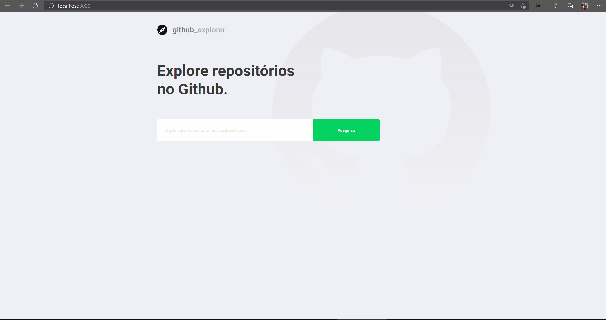

# 🔥 GITHUB_EXPLORER 🔥


 ## ✅ Explore Repositórios no GitHub

 O Github Explorer é uma aplicação que utiliza a API pública do Github,
 listando informações dos repositórios sendo elas: 
 Nome Completo, Descrição, Estrelas, Issues, Forks, Login, Avatar_URL

 
## ✅ Status do Projeto


##  ✅ Features

- [x] Acesso API Publica GitHub
- [x] Buscando owner/repository
- [x] Listando repositorio.
- [x] Salvar Busca em Local Storage
- [x] Tela de informações dos repositórios e issues
- [x] Acesso a URL das Issues
- [x] Erro ao buscar repositório inválido
- [x] Erro ao buscar repositório campo vazio  

## ✅ Demonstração da aplicação

<h1 align="center">
  
</h1>


## ✅ Tecnologias utilizadas

### 🛠 Tecnologias

As seguintes ferramentas foram usadas na construção do projeto:

- [TypeScript ⚡](https://www.typescriptlang.org/)
- [ReactJS ⚡](https://pt-br.reactjs.org/)
- [Styled Components ⚡](https://styled-components.com/)
- [React-Router-Dom ⚡](https://reactrouter.com/web/guides/quick-start)
- [Feather-Icons ⚡](https://feathericons.com/)
- [Polished ⚡](https://polished.js.org/)
- [Axios ⚡](https://www.npmjs.com/package/axios)


<Div style{alingnItems: 'center'}>

</Div>


#### Clonando o projeto
```sh
$ git clone https://github.com/kauayf/git_explorer.git
$ cd git_explorer
```
#### Iniciando a API
```sh
$ cd

# Rodando as migrations para o banco de dados e iniciando o projeto
 1° - $ yarn - "Instalando dependencias do projeto"
 3° - $ yarn start - "Iniciando Projeto"
```

### :memo: Licença

Este projeto é desenvolvido sob a licença MIT. Veja o arquivo [LICENSE]() para saber mais detalhes.

<p align="center" style="margin-top: 20px; border-top: 1px solid #eee; padding-top: 20px;">Feito com 💙 by <strong>  🌠 Kauay Felipe 🌠  </strong> </p>


[
